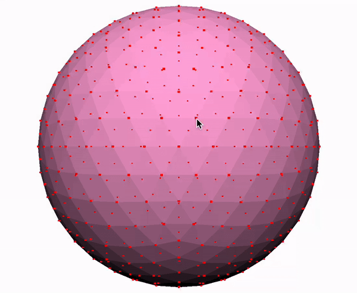
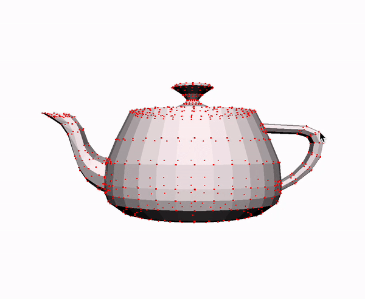
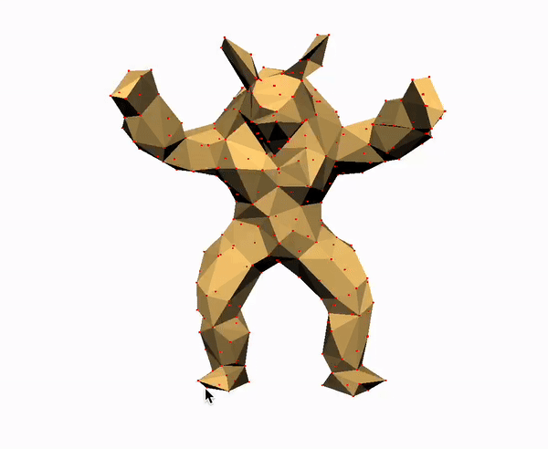
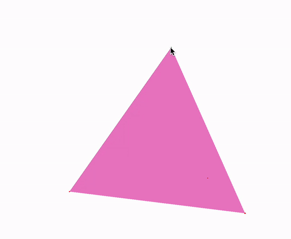
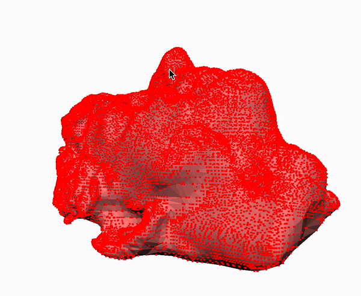

# As-Rigid-As-Possible Surface Modeling

## Running the program
To run the program with different mesh, modify line 20 of `src/arap.cpp` and replace the relative file path <meshes/sphere.obj> with a mesh obj file. 

## Features
This program implements a system for user-interactive physically plausible deformation of 3D meshes. It supports the repositioning of mesh vertices through clicking and dragging, with the system updating the rest of the mesh in response to these user interactions to achieve a movement as rigid as possible. 

This is accomplished by alternating between estimating the best-fit rigid transformation for each mesh vertex and solving a sparse linear system to determine new mesh vertex positions. Additionally, the program parallelizes the update of vertex positions and the calculation of rotation matrices using OpenMP.

## Example Videos

| Program Specification                                                                                                                                                     | Example                          |
| :------------------------------------------------------------------------------------------------------------------------------------------------------------------------ | :----------------------------------- |
| Anchoring exactly one point, then moving that point, results in perfectly rigid motion (mostly translation, though some rotation for smaller meshes is acceptable).       |       |
| Anchoring exactly two points, then rotating one point around the other at a fixed distance, results in perfectly rigid rotation.                                          |       |
| Deformations are "permanent"; i.e. un-anchoring previously moved points leaves the mesh in its deformed state, and further deformations can be made on the deformed mesh. |         |
| You should be able to make the armadillo wave.                                                                                                                            |    |
| Attempting to deform `tetrahedron.obj` should not cause it to collapse or behave erratically.                                                                             |  |
| Attempting to deform a (large) mesh like `bunny.obj` or `peter.obj` should not cause your code to crash.                                                                  |        |

## Reference
[As-Rigid-As-Possible Surface Modeling](https://igl.ethz.ch/projects/ARAP/arap_web.pdf) on the mathematics behind the ARAP algorithm.
